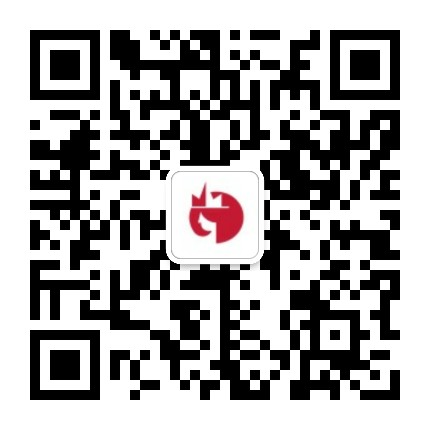

# Hera

Hera 是一个用小程序方式来写跨平台应用的开发框架，使用它可以让你的小程序除了在微信上运行，还可以打包成 Android 、 iOS应用，以及以h5的方式跑在浏览器端

## 快速体验

安装脚手架

```sh
npm i hera-cli -g
```

初始化项目

```sh
hera init projectName
```

运行于浏览器中：

```sh
hera run web
```

运行于客户端上请参考：[快速上手](https://weidian-inc.github.io/hera/#/basics/quickstart)


## 项目目录

目前该项目源码由以下部分构成：

```tree
.
├── README.md
├── android
├── docs
├── h5
└── ios
```

- `android`   和 `ios` 目录下为小程序API 在客户端上的实现
- `h5` 目录下为小程序转换工具：将小程序转换为客户端可以执行的代码
- `docs` 目录下为项目文档及主页生成器

## 特别说明

本项目h5部分的实现参考了微信小程序的框架实现，目前兼容了大部分微信小程序常用的api。hera内置的demo也是直接使用了微信小程序的官方demo并做了一些调整。在此特别感谢微信小程序开发团队。

## 代码贡献者（按字母排序）

- Android: 陈卓、廖朋伟、宋士民
- iOS:  何欣宇、孙宇、王艺桥
- H5：戴越越、丁俊杰、彭观发


## 分享交流

微信群|QQ群
:---:|:---:
  |  

## Licence

BSD License

Copyright (C) 2017, [weidian.com](https://weidian.com)

All rights reserved.
