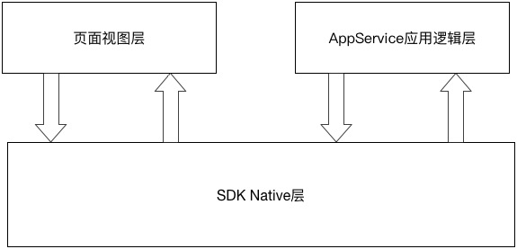
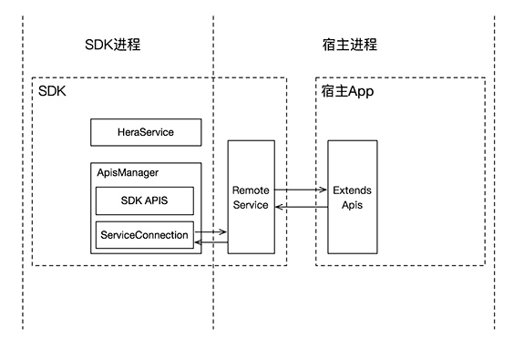

# Hera Android SDK的设计实现

Hera Android SDK被设计为运行在独立的进程中，独享进程内存，提供了可供小程序运行的丰富的API和组件，同时也提供了扩展API的能力。SDK的核心功能主要有两部分，`逻辑流程控制`和`API实现`。

### 逻辑流程控制
SDK Native层[`HeraActivity`]作为逻辑流程控制中心，建立了页面视图层[`Page`]与AppService应用逻辑层[`AppService`]之间的联系，处理两层之间的事件传递及数据流转，同时也处理API的调用并返回结果。

### API实现
SDK本身提供了丰富的[API](../../docs/zh-cn/Others/API.md)实现，同时也提供了扩展API的接口，方便被接入的App实现自定义的API功能。由于SDK运行于独立进程，因此通过进程通信的方式调用宿主提供的扩展API。

