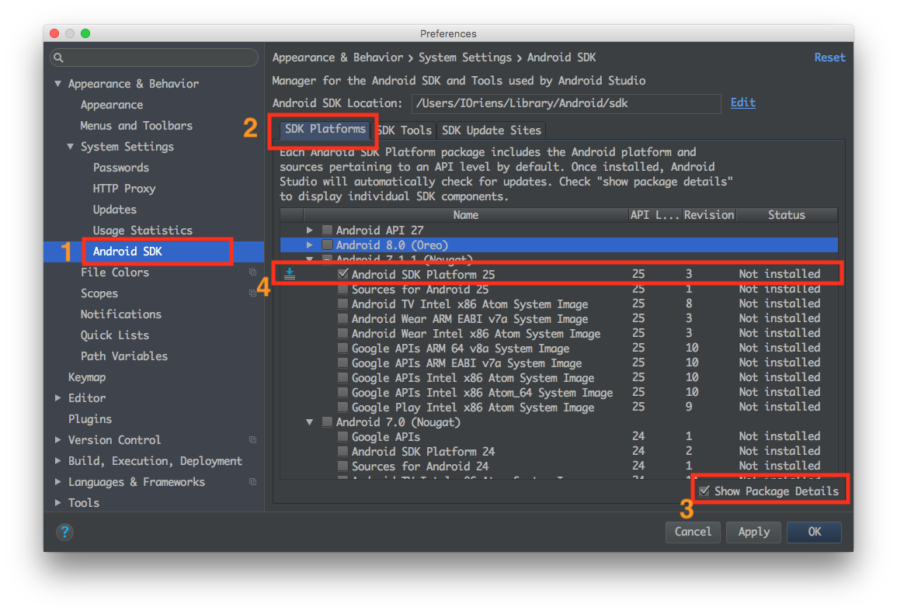

## 安卓

## Android Studio
目前需要[Android Studio](http://developer.android.com/sdk/index.html)2.0或更高版本。

> Android Studio需要Java Development Kit [JDK] 1.8。你可以在命令行中输入 javac -version来查看你当前安装的JDK版本。如果版本不合要求，则可以到[官网](http://www.oracle.com/technetwork/java/javase/downloads/jdk8-downloads-2133151.html
)上下载。


安装过程中有一些需要改动的选项：

- 选择`Custom`选项:


- 勾选`Performance`和`Android Virtual Device`


- 安装完成后，在Android Studio的启动欢迎界面中选择`Configure | SDK Manager`。


- 在`SDK Platforms`窗口中，选择`Show Package Details`，然后在`Android 6.0 (Marshmallow)`中勾选`Android SDK Platform 25`, 如果想要使用虚拟机，还需要勾选`Google APIs`、`Intel x86 Atom System Image`、`Intel x86 Atom_64 System Image`以及`Google APIs Intel x86 Atom_64 System Image`



- 在`SDK Tools`窗口中，选择`Show Package Details`，然后在`Android SDK Build Tools`中勾选`Android SDK Build-Tools 25.0.3`（必须是这个版本）。然后还要勾选最底部的`Android Support Repository`


## ANDROID_HOME环境变量

确保`ANDROID_HOME`环境变量正确地指向了你安装的Android SDK的路径。具体的做法是把下面的命令加入到`~/.bash_profile`文件中：(译注：~表示用户目录，即/Users/你的用户名/，而小数点开头的文件在Finder中是隐藏的，并且这个文件有可能并不存在。请在终端下使用`vi ~/.bash_profile`命令创建或编辑。如不熟悉vi操作，请点击这里学习）。如果你的命令行不是bash，而是例如zsh等其他，请使用对应的配置文件。

如果你不是通过Android Studio安装的sdk，则其路径可能不同，请自行确定清楚。

```sh
export ANDROID_HOME=~/Library/Android/sdk
```

然后使用下列命令使其立即生效（否则重启后才生效）：

```sh
source ~/.bash_profile
```

可以使用`echo $ANDROID_HOME`检查此变量是否已正确设置。

## 将Android SDK的Tools目录添加到PATH变量中

你可以把Android SDK的`tools`和`platform-tools`目录添加到`PATH`变量中，以便在终端中运行一些Android工具，例如`android avd`或是`adb logcat`等。具体做法仍然是在`~/.bash_profile`中添加：

```sh
export PATH=$PATH:$ANDROID_HOME/tools:$ANDROID_HOME/platform-tools
```