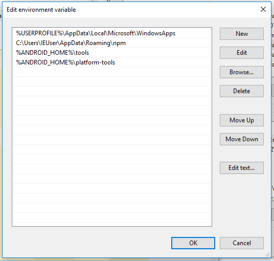

# 安卓环境搭建

## 安装JDK

请在命令行中输入以下命令：

```sh
javac -version
```

如果版本低于 `1.8` 或是找不到 `Java` 命令, 请[点此](http://www.oracle.com/technetwork/java/javase/downloads/jdk8-downloads-2133151.html)下载适合您系统的 `JDK`。

## 安装 Android Studio

如果您的系统中没有安装过 `Android Studio`, 请[点此下载](https://developer.android.google.cn/studio/index.html), 同样全程确定即可。

安装过程中可能会出现如下提示, 如果您系统中有使用代理可以点击`Setup Proxy`来设置代理，如果没有点击`Cancel` 即可。


如下图，安装完成后，在 `Android Studio` 的启动欢迎界面中选择`Configure | SDK Manager`。


如下图，在`SDK Platforms`窗口中，选择`Show Package Details`，勾选`Android SDK Platform 25`


然后在`SDK Tools`窗口中，选择`Show Package Details`，勾选`Android SDK Build-Tools 25.0.3`。然后还要勾选最底部的`Android Support Repository`


最后点击确认安装前面提到的工具。


## 设置环境变量

### Linux 和 Mac 用户

将下面的命令添加到 `~/.bash_profile` 或 `~/.zshrc` 文件中

```sh
# 如果你不是通过Android Studio安装的sdk，则其路径可能不同，请自行确定清楚。
export ANDROID_HOME=~/Library/Android/sdk

export PATH=$PATH:$ANDROID_HOME/tools:$ANDROID_HOME/platform-tools
```

使用以下命名使上述操作生效：

```sh
source ~/.bash_profile
```

### Windows 用户

> 请首先阅读[如何设置环境变量](https://jingyan.baidu.com/article/7e44095332c60c2fc1e2ef58.html)

按照前述步骤打开 SDK Manager， 确认您SDK安装的位置, 如下图红框所示：


新建`ANDROID_HOME`环境变量，将上面的地址填入其中：


然后在 PATH 环境变量中增加`%ANDROID_HOME%\platform-tools`和`%ANDROID_HOME%\platform-tools`



## 最后

恭喜您，已经完成了安卓开发环境的配置，现在您可以返回[首页的教程](https://weidian-inc.github.io/hera/#/basics/quickstart)，使用脚手架来初始化一个小程序应用，并将其运行在您的手机或虚拟机中。