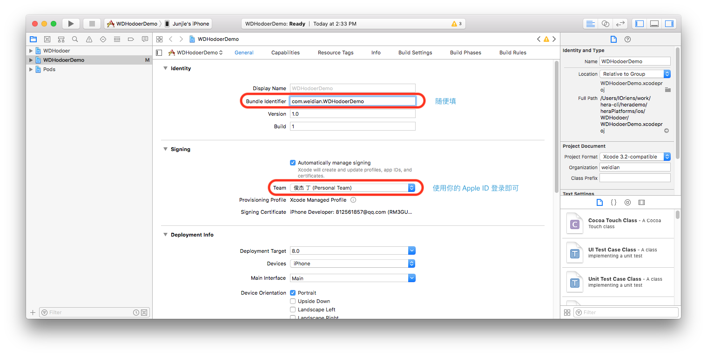
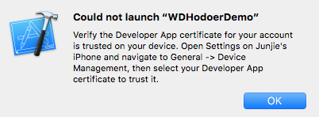

# 真机调试

使用 **`iOS` 真机**进行调试时需要执行以下操作，**安卓或 `iOS` 模拟器用户可忽略**

安装完该依赖后即可开始项目的初始化（hera init projName）和构建运行（hera run ios）

- 构建过程中会报错，提示您使用 Xcode 打开iOS项目

- 在 Xcode 中选择 WDHodoerDemo 项目，在 General 页面手动修改团队信息（需要[注册](https://developer.apple.com/account/)一个Apple ID）和 Bundle id

- 点击 Xcode 左上角的运行按钮，将应用安装到真机中，第一次运行可能会出现如下信息，按着提示进行授权即可：打开您的 iPhone -> 打开设置 -> 通用 -> 最下方的设备管理 -> 选择您的 Apple ID -> 点击信任，完成上述操作后回到 Xcode，点击运行即可。

- 上述流程只需配置一次，之后直接使用 `hera run ios` 即可，无需开启 Xcode
