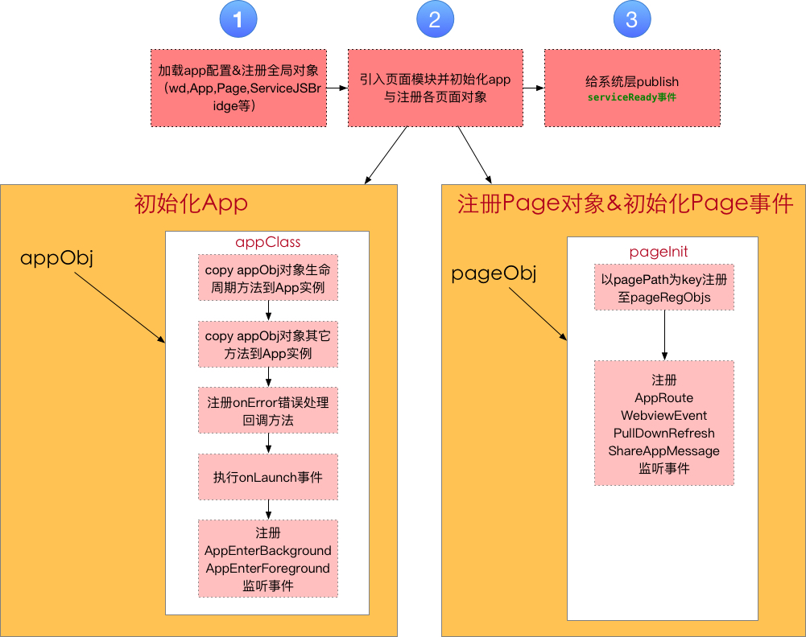
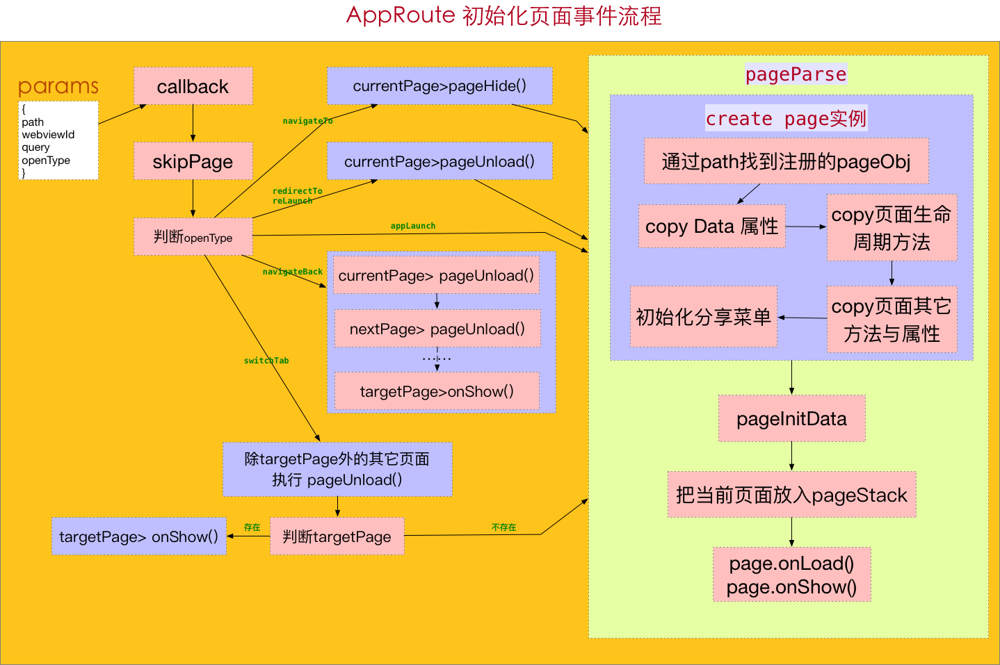
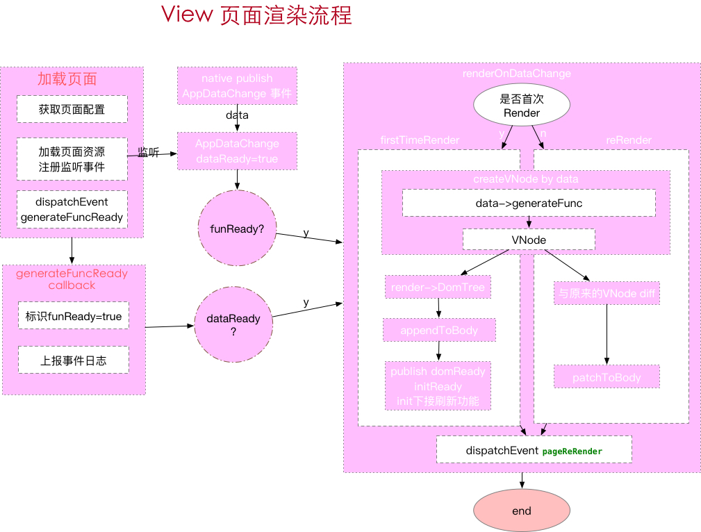

# Hera H5


## Usage

``` sh
# 安装依赖
npm i 

# 开发framework 
npm run dev

# build framework 
npm run build

# 打包framework (打包之前先build)
./bin/weweb -b

# 运行
# 打包demo
./bin/weweb ./demo

```

## 项目介绍

### 1. 目录结构

- h5
- ├── bin         //weweb命令行入口文件
- ├── demo        //小程序demo
- ├── dist        //weweb编译时默认输出目录
- ├── docs        //文档目录
- ├── lib         //weweb命令行依赖库
- ├── src         //框架源码
- └── tmp         //框架源码build后输出目录

#### src目录结构

- src
- ├── common     //service层与view层公共模块目录，包括jsbridge与reporter模块
- ├── css        //通用样式文件
- ├── service    //service层核心库相关模块目录
- ├── template   //框架模板相关文件目录
- └── view      //view层核心库相关模块目录

### 2. 小程序代码转换流程（./bin/weweb ./demo）

- 检测app.json文件是否存在
- 清空并创建指定的输出目录
- 根据service.html模板，带上版本信息输出到指定的目录中
- 读取配置文件app.json，将其注入到service-config.js中,输出到指定的目录中
- 读取所有小程序代码中所有的JS文件，同时判断其是否在app.json中定义，如果其没被定义也不是app.js，说明其为引入的module, 将这些JS路径名存入一个数组中，并确保app.js和页面文件放置在数组尾部
- 遍历JS文件数组并读取它们，根据用户设置项判断是否使用Babel将其转换为es5的代码
- 把js模块封装成CommonJS模块,并合并成app-service.js这个文件输出
- 根据app.json里的pages配置，遍历每个页面根据页面wxml,wxss生成相应的页面文件

### 3. Hera扩展api配置
- 小程序根目录（如：demo目录)增加heraConf.js文件，配置示例如下：

```javascript
module.exports = {
  extApi:[
    {//普通交互API
      name: 'openLink',//扩展api名 该api必须Native方实现了
      params: { //扩展api 的参数格式，可以只列必须的属性
        url: ''
      }
    }
  ]
}

```
### 4. service初始化流程



### 5. View 页面渲染流程



### 6. 源文件打包及转移

``` sh
# 打包framework (打包之前先build)
./bin/weweb -b

# 运行
# 打包demo
./bin/weweb ./demo

```

- 执行命令后会生成zip包，将framework或小程序文件打包，提供给Android及iOS端

## 感谢

小程序转h5 weweb的命令实现前期参考了[wept]项目的实现，目前有部分代码也是沿用了[wept]的或在这基础上改造而来。在此，特别感谢[wept]的作者 chemzqm 的无私奉献

如果你有好的意见或建议，欢迎给我们提 issue 或 PR，为优化 hera 贡献力量

[wept]: https://chemzqm.github.io/wept/#/
